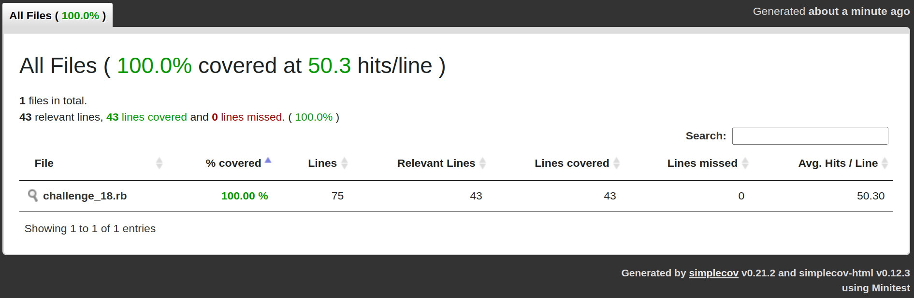
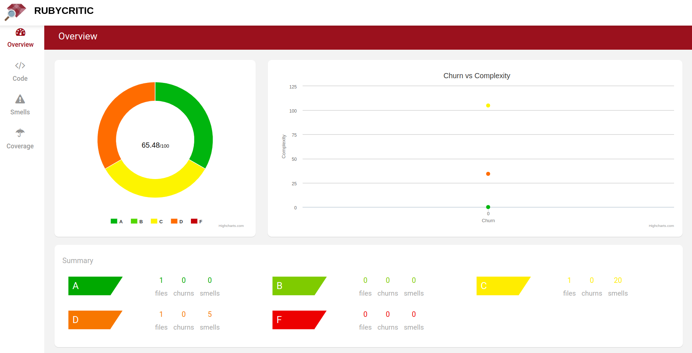
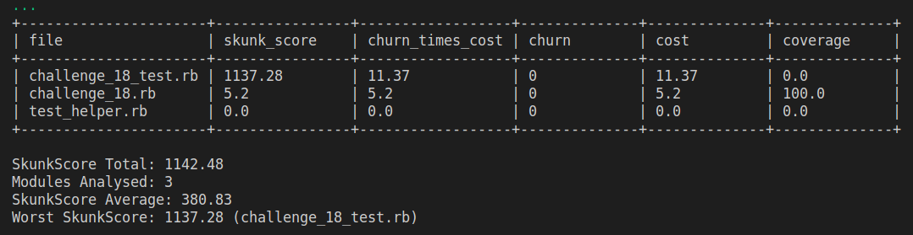

## Challenge 18

Based on the blog post called "[How to Improve Code Quality on a Ruby on Rails Application](https://www.hexdevs.com/posts/code-quality-ruby-on-rails/#rails-code-quality-checklist)", in this challenge I want to follow the next steps to improve my code quality in this application:

- Measure Code Coverage with SimpleCov
- Calculate Churn and complexity with RubyCritic
- Use Skunk to indentify which files need need urgent care

### Measure Code Coverage with SimpleCov

- Install Simplecov gem:
  - `gem install simplecov`
- Add SimpleCov set up:
  - add test_helper.rb file
  - add Rakefile configuration (optional)

To run the test, execute:

- `ruby challenge_18_test.rb`

If you want to use [Rake](https://ruby-doc.org/stdlib-3.1.2/libdoc/rake/rdoc/Rake/TestTask.html) command (A task manager tool), write:

- `rake test`

Either these two commands will generate the _coverage_ directory which include the next statistics:

Yeah! We got it ... 100% coverage, but doesn't mean that our code would be perfect, just means that our unit tests involve several altenativities on what our code could work.

### Calculate Churn and complexity with RubyCritic

- Install
  - `gem install rubycritic`
- Then run in the termial (into de challnge_18 folder):
  - `rubycritic`
- This will generate a `tmp` folder with the `tmp/rubycritic/overview.html` file where we found the [metrics](https://github.com/whitesmith/rubycritic/blob/main/docs/core-metrics.md):

So, here we have a lot of work on the code smells metrics!

### Use Skunk to indentify which files need need urgent care

- Install
  - `gem install skunk`
- Then execure this command:
  - `skunk`
- This tool shows the [Skunk score](https://github.com/fastruby/skunk#what-is-the-skunkscore):

So, now we know which files are the worst, and these tasks could be useful to decrease this score:

- **removing files**, for this, the [Coverband](https://github.com/danmayer/coverband) gem could say what files is not longer in use.
- **refactoring complex files**, for this _skunk_ tool shows the perfect candidates: those with highest score and with coverage different from zero (because those with zero coverage will cost a lot of work). With `skunk -b master` you could compare your current refactoring work with the previuos one and get an statatistic like 10% better than before.
-
